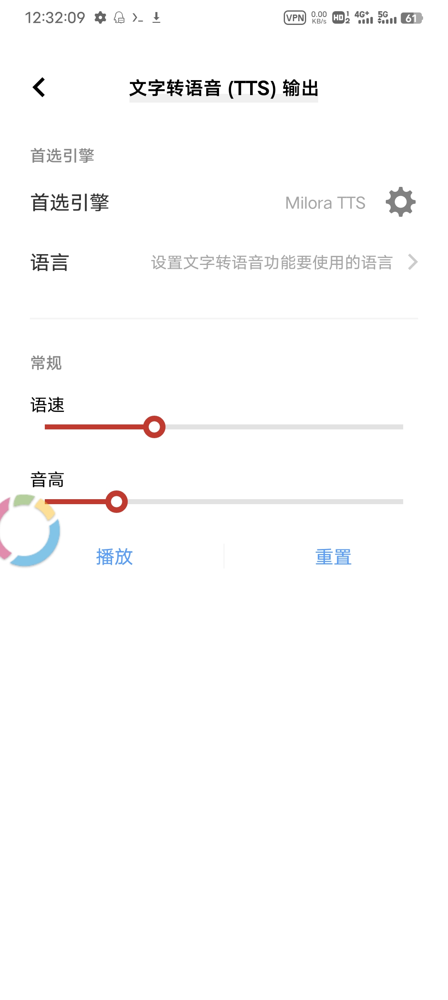
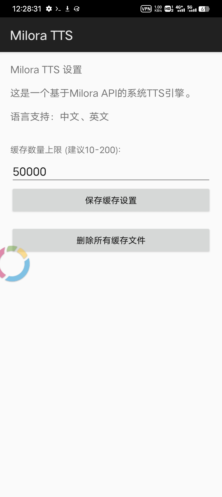

# Milora TTS

A lightweight Android system-wide TTS engine that harnesses the Milora API, offering seamless text-to-speech across any app.

[](https://github.com/KonkaTV514/android-milore-tts/blob/main/LICENSE)
[](https://github.com/KonkaTV514/android-milore-tts/stargazers)
[](https://github.com/KkaTV514/android-milore-tts/issues)

## ✨ Features

- **System-wide Integration**: Set as default Android TTS engine to work with any app that supports system text-to-speech
- **Lightweight**: Minimal APK size (~200KB) with no bloat
- **Smart Caching**: Local caching of synthesized speech to reduce network usage and improve response time
- **Configurable Cache**: Customizable cache size limits with automatic pruning
- **Multi-language Support**: Chinese and English language support
- **Open Source**: MIT licensed - free to use, modify, and distribute

## 📱 Screenshots

| System TTS Settings | App Settings |
|---------------------|--------------|
|  |  |

*Note: Add your actual screenshots to a `screenshots/` folder*

## 🚀 Quick Start

### Prerequisites
- Android device with Android 5.0+ (API 21+)
- Internet connection (for API calls)
- Enable "Unknown sources" for APK installation

### Installation
1. Download the latest APK from [Releases](https://github.com/KonkaTV514/android-milore-tts/releases)
2. Install the APK on your Android device
3. Go to **Settings > Accessibility > Text-to-speech output**
4. Select **Milora TTS** as your preferred engine
5. Adjust speech rate and other settings as needed

### Building from Source
```bash
git clone https://github.com/KonkaTV514/android-milore-tts.git
cd android-milore-tts
# Open in Android Studio or build with gradle
./gradlew assembleDebug
```

## ⚙️ Configuration

### Cache Settings
The app allows you to configure cache behavior:
- **Cache Limit**: Set maximum number of cached audio files (recommended: 10-200)
- **Clear Cache**: Manually remove all cached files
- **Clear Data**: Reset all app preferences and cached data

### API Usage
This app uses the [Milora API](https://api.milorapart.top/) for speech synthesis. The API is called with:
- **Text**: The content to be synthesized
- **Format**: Audio format (mp3 or wav, defaults to mp3)

## 📖 How It Works

Milora TTS implements Android's `TextToSpeechService` to provide a system-level TTS engine:

1. **Text Processing**: Receives text from any Android app via system TTS framework
2. **Cache Check**: First checks local cache for previously synthesized speech
3. **API Call**: If not cached, sends request to Milora API for synthesis
4. **Audio Decoding**: Decodes MP3 response to PCM audio using MediaCodec
5. **Playback/Caching**: Plays audio through system and caches for future use

## 🤝 Contributing

Contributions are welcome! Please feel free to submit a Pull Request.

1. Fork the repository
2. Create your feature branch (`git checkout -b feature/amazing-feature`)
3. Commit your changes (`git commit -m 'Add some amazing feature'`)
4. Push to the branch (`git push origin feature/amazing-feature`)
5. Open a Pull Request

## ⚠️ Important Notes

- **Internet Required**: This TTS engine requires an active internet connection to function
- **Third-party API**: Speech synthesis depends on the Milora API, which is a separate service
- **Privacy**: Text sent for synthesis is transmitted to Milora's servers
- **Service Reliability**: Functionality depends on Milora API availability

## 📄 License

This project is licensed under the MIT License - see the [LICENSE](LICENSE) file for details.

**Disclaimer**: This is an unofficial client for the Milora API. The API service terms and conditions are governed by Milora.

## 🙏 Acknowledgements

- [Milora API](https://api.milorapart.top/) for providing the speech synthesis service
- Android TTS framework for the system integration capabilities
- All contributors and users of this project

---

**Milora TTS** - Bringing cloud-based speech synthesis to your Android system.